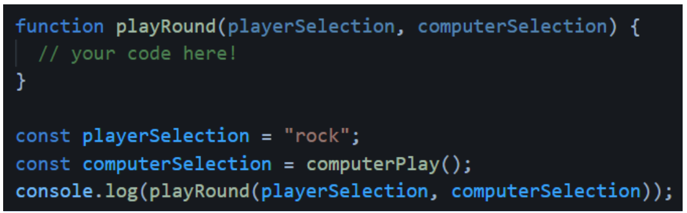
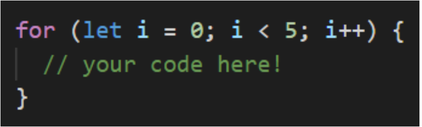

_Brainnest Frontend Industry Training_

---

# JavaScript

## Assignment 4 - Project

1. Create a blank HTML document with a script tag (Hint: it is best practice to link an
external .js file). This game is going to be played completely from the console, so don’t
worry about putting anything else in there.
2. Your game is going to play against the computer, so begin with a function called
**computerPlay** that will randomly return either **‘Rock’, ‘Paper’ or ‘Scissors’**. We’ll use this function in the game to make the computer’s play. Tip: use the console to make sure this is returning the expected output before moving to the next step!
3. Write a function that plays a single round of Rock Paper Scissors. The function should take two parameters - the **playerSelection** and **computerSelection** - and then return a string that declares the winner of the round like so: *"You Lose! Paper beats Rock"*
- Make your function’s playerSelection parameter case-insensitive (so users can input rock, ROCK, RocK or any other variation). ([Here’s](https://gomakethings.com/converting-strings-to-uppercase-and-lowercase-with-vanilla-javascript/#:~:text=JavaScript%20provides%20two%20helpful%20functions,converts%20a%20string%20to%20uppercase.) a tip on how to do that)
4. **Important note:** you want to return the results of this function call, not console.log() them. You’re going to use what you return later on, so let’s test this function by using console.log to see the results:
    
 5. Write a NEW function called **game()**. Call the **playRound** function *inside* of this one to play a 5 round game that keeps score and reports a winner or loser at the end.
- [Remember loops?](https://www.youtube.com/watch?v=s9wW2PpJsmQ) This is a great opportunity to use one to play those five rounds:
    
- At this point you should be using console.log() to display the results of each round and the winner at the end.
- Use **prompt()** to get input from the user. [Read the docs here](https://developer.mozilla.org/en-US/docs/Web/API/Window/prompt).
- Feel free to re-work your previous functions if you need to. Specifically, you
might want to change the return value to something more useful.
- Feel free to re-work your previous functions if you need to. Specifically, you
might want to change the return value to something more useful.
